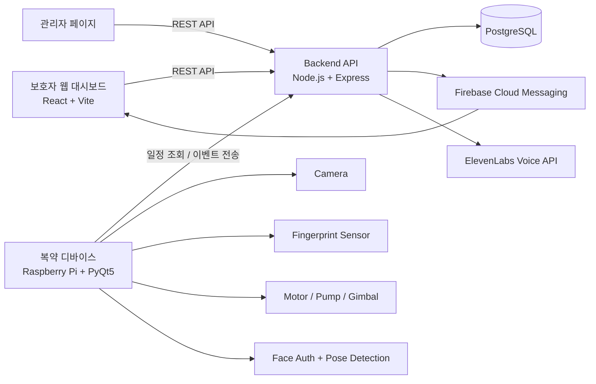
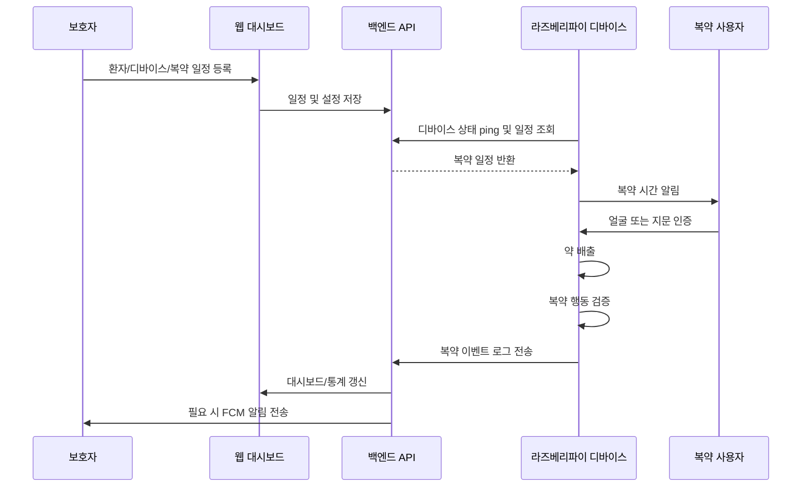
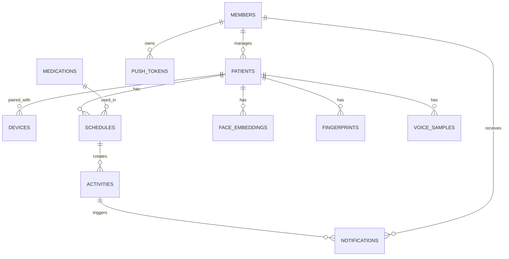

# Carefull - AI 스마트 복약 관리 시스템

## 서비스 소개

### 서비스명
Carefull

### 서비스 설명
Carefull은 고령자와 복약 관리가 필요한 사용자를 위한 AI 기반 스마트 복약 관리 시스템입니다.  
라즈베리파이 디바이스에서 복약 시간 알림, 얼굴/지문 인증, 약 배출, 복약 행동 검증을 수행하고, 보호자는 웹 대시보드에서 환자 상태와 복약 기록을 확인할 수 있습니다.

이 프로젝트는 **라즈베리파이 IoT 디바이스**, **Node.js 백엔드 API**, **React 보호자 대시보드**로 구성됩니다.

### 프로젝트 기간
2026.04 ~ 2026.05

## 주요 기능

**스마트 복약 알림**  
보호자가 등록한 복약 일정에 따라 라즈베리파이 디바이스가 알림음과 음성 안내를 제공합니다.

**사용자 인증**  
복약 전 얼굴 인증을 우선 수행하고, 실패 시 지문 인증으로 대체할 수 있습니다.

**자동 약 배출**  
인증 성공 후 스텝 모터와 배출 장치를 제어해 정해진 복약 절차를 진행합니다.

**AI 복약 행동 검증**  
MediaPipe 기반 자세 분석으로 손과 얼굴의 거리를 판단해 실제 복약 행동 여부를 검증합니다.

**보호자 웹 대시보드**  
복약 일정, 환자 정보, 디바이스 상태, 알림, 통계, 복약 로그를 웹에서 확인하고 관리합니다.

**푸시 알림**  
FCM을 통해 미복약, 디바이스 상태, 주요 이벤트를 보호자에게 전달합니다.

**음성 안내 커스터마이징**  
ElevenLabs 연동으로 보호자 음성 기반 안내 음성을 생성하고 디바이스에 적용할 수 있습니다.

## 기술 스택

<table>
<tr>
<th>구분</th>
<th>기술</th>
</tr>
<tr>
<td><b>Programming Language</b></td>
<td>


</td>
</tr>
<tr>
<td><b>Frontend</b></td>
<td>


</td>
</tr>
<tr>
<td><b>Backend</b></td>
<td>


</td>
</tr>
<tr>
<td><b>Database</b></td>
<td>

</td>
</tr>
<tr>
<td><b>IoT / Hardware</b></td>
<td>


</td>
</tr>
<tr>
<td><b>AI / Vision</b></td>
<td>


</td>
</tr>
<tr>
<td><b>Cloud / Notification</b></td>
<td>


</td>
</tr>
<tr>
<td><b>DevOps</b></td>
<td>


</td>
</tr>
</table>

## 시스템 아키텍처



## 서비스 흐름



## ERD 요약



주요 테이블:

| 테이블 | 설명 |
|---|---|
| `members` | 보호자 계정 |
| `patients` | 환자 정보 |
| `devices` | 복약 디바이스 |
| `schedules` | 복약 일정 |
| `activities` | 복약 로그 |
| `medications` | 약품 정보 |
| `face_embeddings` | 얼굴 인증 벡터 |
| `fingerprints` | 지문 센서 slot 정보 |
| `voice_samples` | 보호자 음성/안내 음성 |
| `notifications` | 알림 이력 |
| `push_tokens` | FCM 토큰 |

## 화면 구성

### 보호자 웹

- 로그인 및 소셜 로그인 콜백
- 대시보드
- 복약 일정 관리
- 통계 페이지
- 알림 페이지
- 환자 정보 관리
- 디바이스 등록/상태 확인
- 설정 및 음성/알림음 관리

### 관리자 웹

- 관리자 로그인
- 회원/환자/디바이스/일정/복약 로그 관리
- 테스트 데이터 생성
- 테스트 푸시 발송

### 라즈베리파이 디바이스 UI

- 홈 화면
- 복약 시작 안내
- 얼굴 인증 화면
- 지문 인증 화면
- 약 배출 화면
- 복약 행동 검증 화면
- 완료 화면
- 사용자 등록 화면
- 설정 화면

## 폴더 구조

```text
carefull/
├── backend/       # Node.js + Express API 서버
├── frontend/      # React + Vite 보호자/관리자 웹
├── raspberry/     # PyQt5 라즈베리파이 복약 디바이스 앱
├── data/          # AI/행동 인식용 데이터 파일
├── dev_test/      # 카메라, AI, 하드웨어 실험 코드
├── docs/          # 분석/작업 문서
└── .github/       # GitHub Actions 배포 workflow
```

## 실행 방법

### Backend

```bash
cd backend
npm install
npm start
```

필수 환경변수:

```env
PORT=3000
DB_HOST=
DB_USER=
DB_PASSWORD=
DB_NAME=
DB_PORT=5432
JWT_SECRET=
ALLOWED_ORIGINS=
FRONTEND_URL=
```

### Frontend

```bash
cd frontend
npm install
npm run dev
```

필수 환경변수:

```env
VITE_API_BASE_URL=http://localhost:3000
```

빌드:

```bash
cd frontend
npm run build
```

### Raspberry Pi

```bash
cd raspberry
python main.py
```

주요 환경변수:

```env
CAREFULL_API_BASE_URL=http://localhost:3000
CAREFULL_CAMERA_WIDTH=640
CAREFULL_CAMERA_HEIGHT=480
CAREFULL_SCHEDULE_POLL_SECONDS=30
CAREFULL_FACE_MATCH_THRESHOLD=0.85
CAREFULL_FULLSCREEN=1
```

라즈베리파이에서는 `picamera2`, `PyQt5`, GPIO 관련 패키지 등 시스템 의존성이 필요합니다.

## API 요약

| Prefix | 역할 |
|---|---|
| `/api/user` | 사용자 로그인, 소셜 로그인 |
| `/api/patient` | 환자 등록/조회/수정 |
| `/api/medication` | 약품 검색 |
| `/api/schedule` | 복약 일정 CRUD |
| `/api/dashboard` | 대시보드 요약 |
| `/api/device` | 디바이스 등록, ping, 지문, 음성/알림음 |
| `/api/face-data` | 얼굴 임베딩 등록/조회 |
| `/api/notification` | 알림 목록/읽음 처리 |
| `/api/log` | 복약 활동 로그 |
| `/api/push` | FCM 푸시 등록/테스트 |
| `/api/admin` | 관리자 기능 |
| `/api/voice` | ElevenLabs 음성 생성 |

## 팀원 역할

| 이름 | 역할 |
|---|---|
| 양채린 | PM, AI 모델링, DB 설계 |
| 오승현 | IoT, 라즈베리파이, 임베디드 |
| 양일오 | IoT 보조 |
| 한세범 | 프론트엔드 |
| 송현수 | UI/UX, 웹 디자인 |
| 이승형 | 백엔드 서버 |

## 트러블슈팅

### Issue 1. 라즈베리파이 환경에서 AI 처리 성능 제한

문제: 라즈베리파이에서 얼굴 인증, 카메라 처리, 복약 행동 검증을 동시에 수행하면 CPU 부하와 지연이 발생할 수 있습니다.

해결: 얼굴 인증, 모터 제어, 행동 검증을 순차적으로 실행하도록 흐름을 분리하고, MobileFaceNet TFLite와 MediaPipe를 사용해 엣지 환경에 맞게 경량화했습니다.

### Issue 2. 얼굴 인증 실패 시 복약 흐름 중단

문제: 조명, 각도, 카메라 상태에 따라 얼굴 인증이 실패할 수 있습니다.

해결: 얼굴 인증 실패 시 지문 인증으로 대체할 수 있도록 인증 fallback 흐름을 구성했습니다.

### Issue 3. 보호자 알림 누락 가능성

문제: 미복약 또는 디바이스 이벤트가 기록만 되고 보호자에게 즉시 전달되지 않으면 서비스 가치가 떨어집니다.

해결: Firebase Cloud Messaging과 알림 이력 테이블을 연동해 주요 이벤트를 보호자 웹과 푸시 알림으로 전달하도록 구성했습니다.

### Issue 4. 디바이스와 서버 상태 동기화

문제: 디바이스가 오프라인이거나 환자와 연결되지 않은 경우 복약 흐름을 정상적으로 시작하기 어렵습니다.

해결: 디바이스 ping API, device UID 기반 pairing 확인, 얼굴/지문 등록 여부 조회를 통해 UI와 서버 상태를 동기화합니다.

