# Carefull - AI 스마트 복약 관리 및 모니터링 시스템

> 보호자가 복약 스케줄을 등록하고, 라즈베리파이 기반 디바이스가 복약 알림·본인 인증·약 배출·복약 결과 기록을 수행하며, 보호자에게 실시간 알림을 제공하는 IoT 연동 스마트 복약 관리 서비스입니다.

## 🌟 서비스 소개

### 서비스명

Carefull (케어풀)

<table>
  <tr>
    <td align="center">
            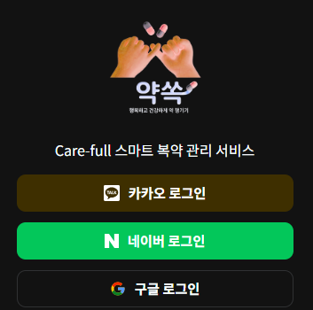
      <br/>
    </td>
    <td align="center">
            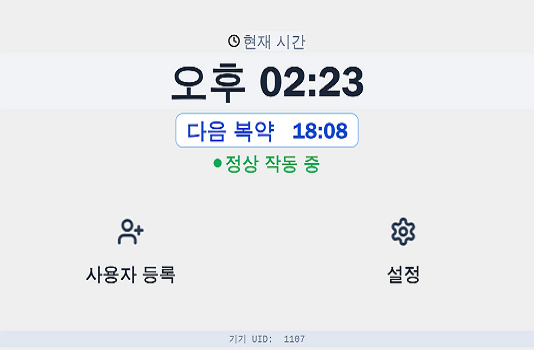
      >
    </td>
  </tr>
</table>

### 서비스 배경 및 설명

고령화 시대에 따라 만성 질환 환자의 복약 준수율 관리가 중요해지고 있습니다. **Carefull**은 보호자가 직접 옆에 없어도 AI 기술을 통해 환자의 복약 과정을 완벽하게 보조하고 모니터링하는 스마트 홈 케어 솔루션입니다.

라즈베리파이 기반의 전용 디바이스는 **안면 인식 및 지문 인증**을 통해 본인 여부를 확인하고, **자동 약 배출** 후 **AI 자세 분석**을 통해 실제 복약 행위를 검증합니다. 보호자는 웹 대시보드를 통해 실시간 복약 현황을 파악하고, AI 보이스 기술을 활용해 **자신의 목소리와 유사한 안내 음성**을 기기에 적용하여 환자에게 심리적 안정감을 제공합니다.

### 프로젝트 기간

2026.04 ~ 2026.05

---

## 🚀 주요 기능

### 1. 지능형 복약 알림 및 본인 인증

* **스마트 알람:** 설정된 시간에 맞춤형 음성 안내와 함께 복약 시작을 알립니다.
* **복합 생체 인증:** **MediaPipe Face Detection** 및 **MobileFaceNet(TFLite)** 기반의 안면 인식을 수행하며, 실패 시 지문 인식을 통해 보안과 편의성을 동시에 확보합니다.

### 2. 자동 약 배출 및 짐벌 추적

* **정밀 배출:** 스텝 모터 제어를 통해 정해진 회차의 약을 정확하게 배출합니다.
* **얼굴 추적 짐벌:** 카메라 짐벌이 사용자의 얼굴 위치를 실시간으로 추적(Face Tracking)하여 최적의 각도에서 복약 과정을 기록하고 분석합니다.

### 3. AI 기반 복약 행위 감지 (Intake Detection)

* **MediaPipe Pose 분석:** 사용자의 코(Nose)와 손목(Wrist) 사이의 유클리드 거리를 실시간으로 계산합니다.
* **동작 검증:** 단순히 약을 꺼내는 동작이 아닌, 입 근처로 가져가는 행위를 AI가 판단하여 실제 복약 여부를 최종 확정합니다.

### 4. 보호자 맞춤형 AI 보이스 (ElevenLabs TTS)

* **맞춤형 음성 가이드:** 보호자가 웹에서 선택한 목소리와 입력한 문구를 **ElevenLabs Multilingual v2** 모델을 통해 고품질 한국어 음성으로 변환합니다.
* **속도 최적화:** 고령 사용자를 위해 말하기 속도를 0.9배로 조정하여 전달력을 높였습니다.

### 5. 통합 모니터링 대시보드

* **실시간 상태:** 기기 연결 상태(Auto-Ping), 약 재고 현황, 복약 성공률을 한눈에 확인합니다.
* **푸시 알림:** 미복약 발생이나 기기 오류 시 **FCM(Firebase Cloud Messaging)**을 통해 즉시 알림을 발송합니다.

---


## 🛠 기술 스택

| 분류 | 기술 |
| :--- | :--- |
| **Language** |     |
| **Frontend** |      |
| **Backend** |     |
| **Database** |  |
| **AI / Vision** |     |
| **IoT / Hardware** |       |
| **Communication / Notification** |   |
| **AI Voice** |  |
| **DevOps / Deploy** |     |

## 🏗 시스템 아키텍처

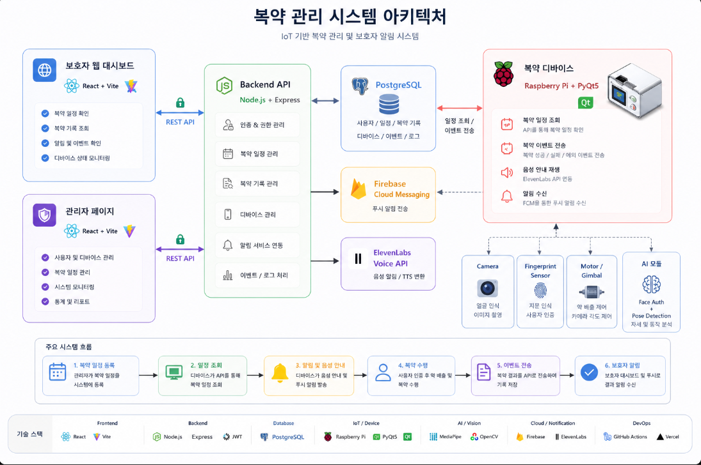
---


---

## 📈 데이터 흐름 및 로직

1. **동기화:** 라즈베리파이는 **5초 주기**로 서버와 통신하여 보호자가 설정한 최신 복약 스케줄과 음성 설정을 다운로드합니다.
2. **인증:** 복약 시간이 되면 안면 인식을 시도하며, **Cosine Similarity(임계값 0.85)**를 통해 본인임을 확인합니다.
3. **검증:** 약 배출 후, 사용자의 손목과 코의 거리가 **0.3(정규화 거리)** 이내로 좁혀지는 동작이 **4프레임 이상** 유지될 때 복약 성공으로 기록합니다.
4. **피드백:** 모든 활동 로그는 즉시 서버로 전송되어 대시보드 통계에 반영되며, 이상 발생 시 보호자에게 푸시 알림이 전송됩니다.

---

## 📂 프로젝트 구조

```text
carefull/
├── backend/       # API 서버, ElevenLabs 연동, 스케줄 관리
├── frontend/      # React 대시보드, PWA 지원, 실시간 모니터링
├── raspberry/     # 하드웨어 제어, AI 모델 실행(Edge AI), PyQt UI
├── data/          # 얼굴 임베딩 및 AI 분석용 데이터
└── docs/          # 기술 명세서 및 아키텍처 가이드
```

## 🗄 ERD / DB 구조

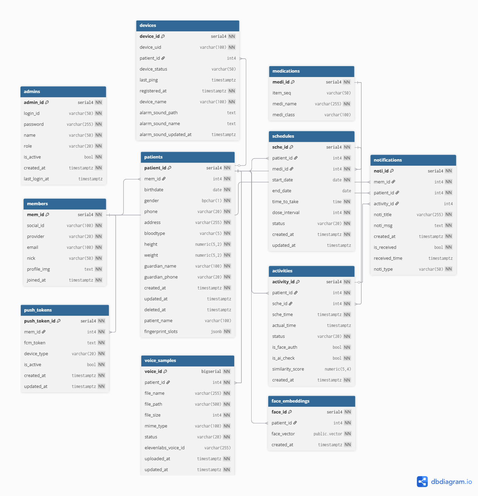


Carefull은 보호자 계정(`members`)을 기준으로 환자(`patients`)를 연결하고, 환자를 중심으로 디바이스, 복약 계획, 실제 복약 결과, 알림, 음성 샘플, 얼굴 임베딩 데이터를 관리합니다.

복약 계획인 `schedules`와 실제 복약 결과인 `activities`를 분리하여 복약률, 미복약, 보호자 알림, 대시보드 통계를 계산할 수 있도록 설계했습니다.

## 🖥 서비스 화면

### 디바이스

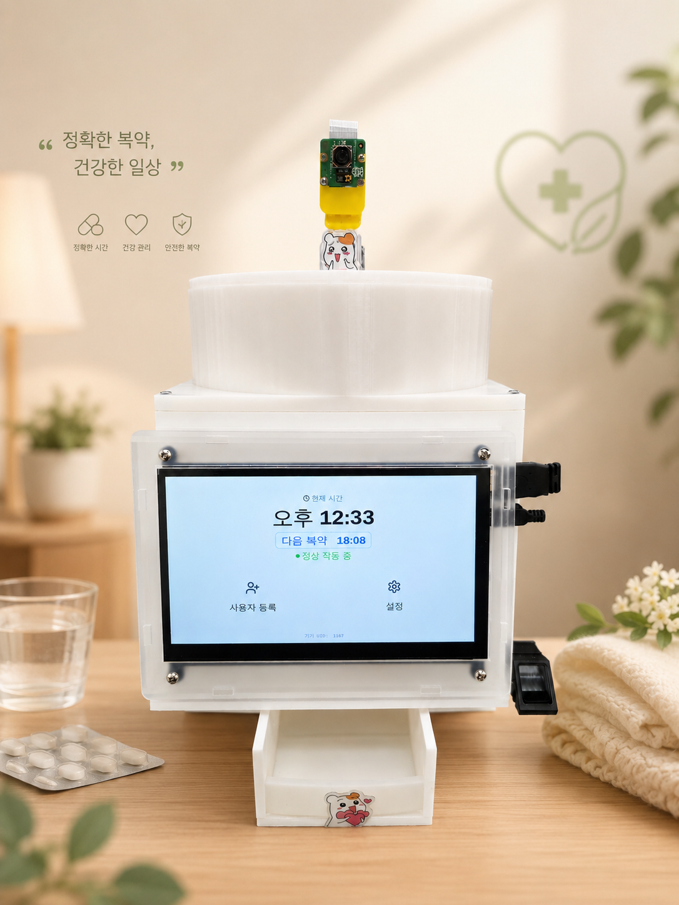

### 보호자 대시보드

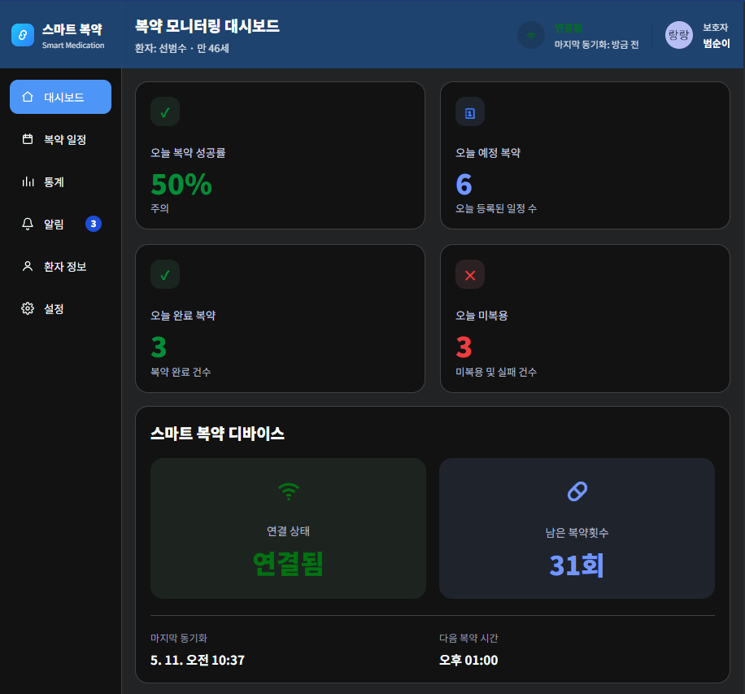

### 복약 스케줄 관리

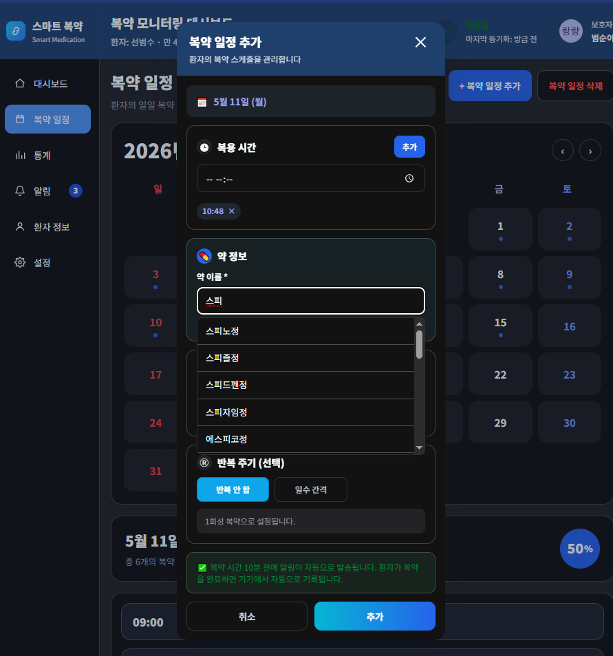

### 복약 이력 및 알림

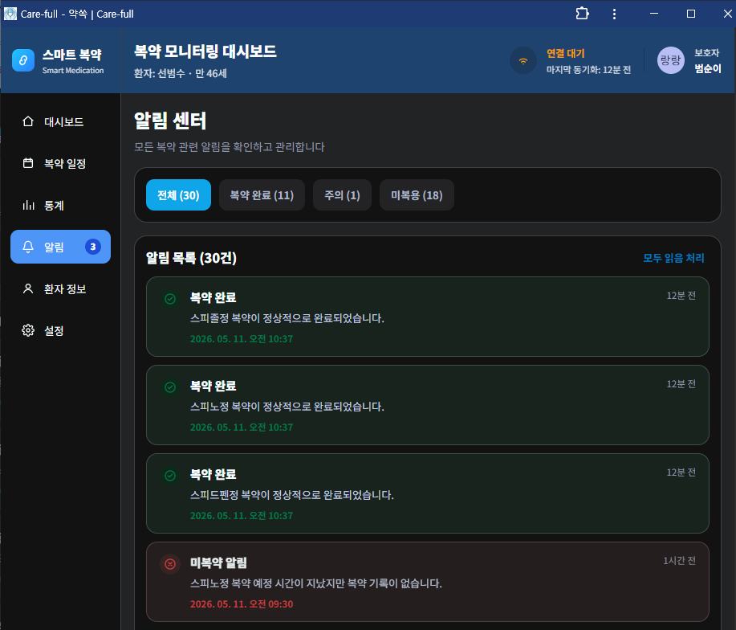

### 지문 등록

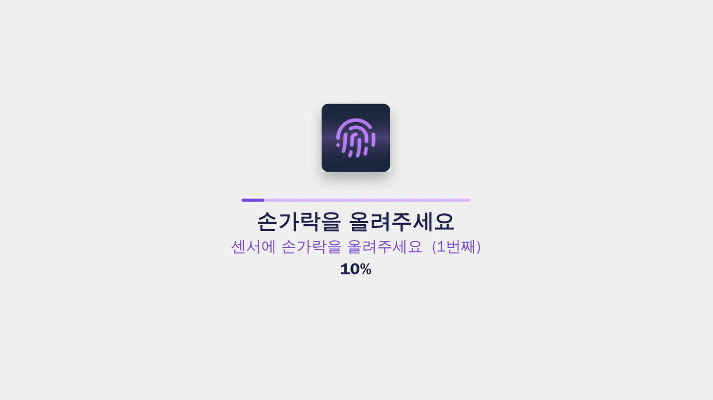

## 🔌 주요 API 흐름

| 구분        | Endpoint                            | 설명                         |
| :-------- | :---------------------------------- | :------------------------- |
| Auth      | `GET /api/user/kakao`               | Kakao 로그인 시작               |
| Auth      | `GET /api/user/google`              | Google 로그인 시작              |
| Auth      | `GET /api/user/naver`               | Naver 로그인 시작               |
| Auth      | `GET /api/user/{provider}/callback` | OAuth callback 처리 및 JWT 발급 |
| Patient   | `POST /api/user/register-patient`   | 환자 및 디바이스 초기 등록            |
| Device    | `POST /api/device/register`         | 보호자 JWT 기반 디바이스 등록         |
| Device    | `POST /api/device/ping`             | 디바이스 연결 상태 갱신              |
| Device    | `GET /api/device/sound`             | 라즈베리파이 알림음 메타 조회           |
| Schedule  | `POST /api/schedule`                | 복약 스케줄 등록                  |
| Schedule  | `GET /api/schedule/device`          | 라즈베리파이용 복약 스케줄 조회          |
| Log       | `POST /api/log/device-event`        | 라즈베리파이 복약 결과 저장            |
| Dashboard | `GET /api/dashboard`                | 보호자 대시보드 통계 조회             |
| Push      | `POST /api/push/register`           | FCM 토큰 등록                  |
| Voice     | `POST /api/voice/upload`            | 보호자 음성 업로드 및 TTS 생성        |

---

## 👨‍👩‍👦‍👦 팀원 역할
<table>
  <tr>
    <td align="center"></td>
    <td align="center"></td>
    <td align="center"></td>
    <td align="center"></td>
    <td align="center"></td>
    <td align="center"></td>
  </tr>
  <tr>
    <td align="center"><strong>장철영</strong></td>
    <td align="center"><strong>윤현우</strong></td>
    <td align="center"><strong>황수영</strong></td>
    <td align="center"><strong>오형석</strong></td>
    <td align="center"><strong>선범수</strong></td>
    <td align="center"><strong>장일선</strong></td>
  </tr>
  <tr>
    <td align="center"><b>👑 Team Leader</b></td>
    <td align="center"><b>IoT / Embedded</b></td>
    <td align="center"><b>UI/UX Design</b></td>
    <td align="center"><b>Backend</b></td>
    <td align="center"><b>Frontend</b></td>
    <td align="center"><b>Hardware Assist</b></td>
  </tr>
  <tr>
    <td align="center">AI 모델링(MobileFaceNet), DB 설계,<br> 프로젝트 총괄, 배포</td>
    <td align="center">하드웨어 제어 로직, 짐벌 추적 시스템, 디바이스 UI 개발 </td>
    <td align="center">고령자 맞춤형 GUI 디자인 및 웹/앱 퍼블리싱</td>
    <td align="center">API 설계, ElevenLabs TTS 시스템 구축, FCM 알림 로직</td>
    <td align="center">웹 대시보드 개발, PWA 연동, 실시간 데이터 시각화</td>
    <td align="center">기구부 설계 및 하드웨어 테스트 지원</td>
  </tr>
  <tr>
    <td align="center"><a href="https://github.com/HyaC1107" target='_blank'>github</a></td>
    <td align="center"><a href="#" target='_blank'>github</a></td>
    <td align="center"><a href="#" target='_blank'>github</a></td>
    <td align="center"><a href="#" target='_blank'>github</a></td>
    <td align="center"><a href="#" target='_blank'>github</a></td>
    <td align="center"><a href="#" target='_blank'>github</a></td>
  </tr>
</table>

---

## ⚠️ 트러블슈팅


### 1. 사용자 얼굴 인증시 프레임(fps)

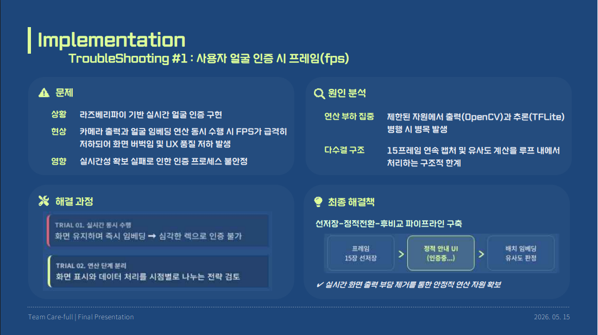

### 2. 복약 행위 검증 AI 모델링

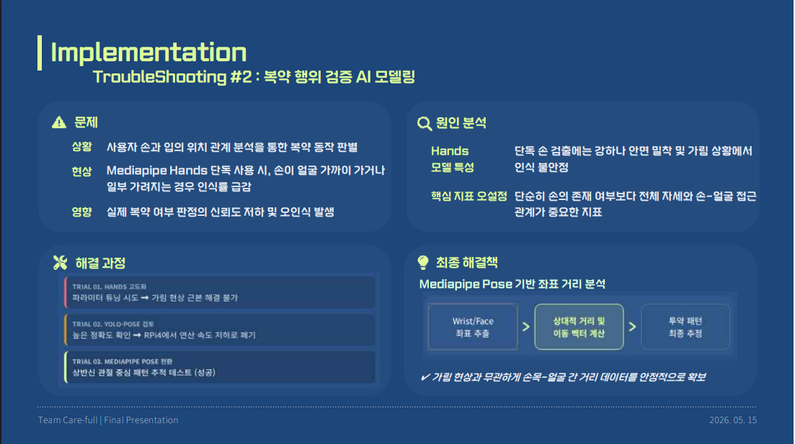

### 3. 복약 일정 삭제 오류

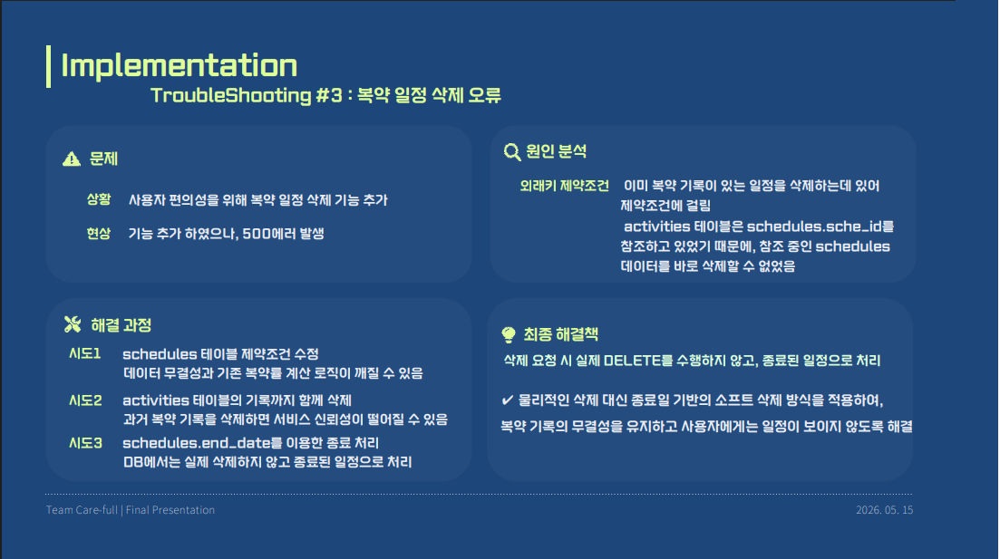
